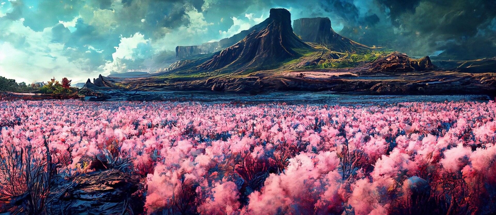
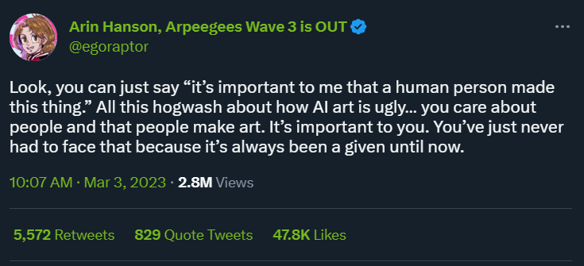
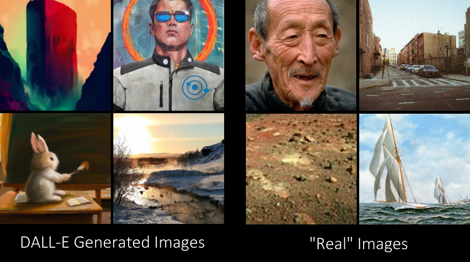
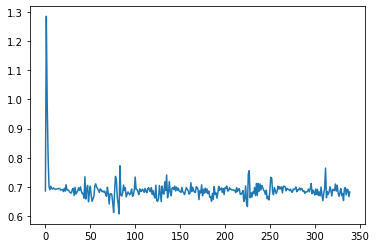
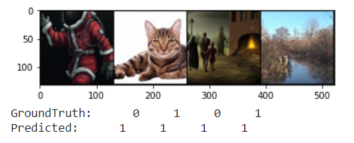

# Using Neural Networks to Detect AI Art

While AI has been used to generate images since its inception, the use of deep learning to generate images resembling art has only recently been brought to the public forefront. Following the public releases of diffusion-based image generation models in mid-2022 such as DALL-E 2, Midjourney, and Stable Diffusion, various moral and ethical concerns have been raised regarding their outputs and methods[1].

  

One concern is that it will be increasingly difficult to tell human-created art from images generated by models. While humans are often better at classifying objects compared to neural networks, a neural network might be useful in detecting the lower-level nuances that distinguish human art from model-generated images. **In this project, we demonstrate that neural networks can detect whether an image is AI-generated, and that transfer learning is surprisingly (or unsurprisingly) powerful for performing this task accurately.**

## Data

The [dataset](https://www.kaggle.com/datasets/superpotato9/dalle-recognition-dataset) used for this project was found on Kaggle. It consists of ~2,500 each real and generated images. The images were generated by the DALL-E 2 model. The image subjects vary greatly, and include portraits, landscapes, and abstract shapes.

  

## Methods

In order to observe the effectiveness of various different neural network types, we started training simpler models on the data and progressed towards more complex and powerful models and methods. The data was split into training and test sets randomly and with a 80-20 split.

### Simple Neural Network

The first network trained on the data had a single layer with a RELU connection. The result was 59% accuracy, which was slightly better than random guessing or picking the most common option. 

  

Shown above is the loss function, which does not show much learning. It appears to simply guess that most images are real, since there are slightly more (300) real images than generated ones. However, it still does better than if it guessed "real" for all images. Here is an example of four images, all of which it guessed were real:

  

### Convolutional Neural Networks

The next nextwork trained on the data was a convolutional neural network with three layers containing image filters for feature extraction. Various permutations of model parameters were tried.
  
| Optimizer | Annealing | Epochs | Batch Normalization | Learning Rate | Accuracy | Precision | Recall |
| - | - | - | - | - | - | - | - |
| SGD | No | 5 | No | 0.1 | 0.67 | 0.68 |  0.77 |

### Transfer Learning

## Discussion

## References

[1] @egoraptor. "Look, you can just say “it’s important to me that a human person made this thing.” All this hogwash about how AI art is ugly… you care about people and that people make art. It’s important to you. You’ve just never had to face that because it’s always been a given until now." *Twitter*, 3 March 2023, 10:07 am, [https://twitter.com/egoraptor/status/1631717867421933583a](https://twitter.com/egoraptor/status/1631717867421933583a).

